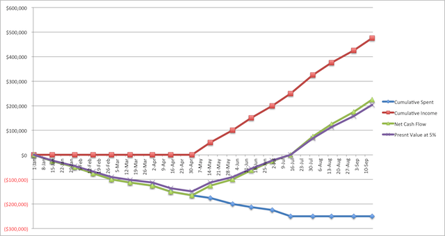

# Assessing the Value of a Project

Because business value is typically expressed in financial terms, accurately assessing the value of a potential project during a feasibilty study can significantly improve the chances of project success.  Providing estimates of high confidence can lead to early and enthusiastic sponsor support.

### Return On Investment
One of the first things a project sponsor will likely want to know, is what is the expected <b>R</b>eturn <b>O</b>n <b>I</b>nvestment for a project.  What the sponsor is really asking is: <b>1)</b> How long is the projected payback period? <b>2)</b> At what value in the income stream will payback occur?  Providing honest, accurate, and clear responses to these questions go a long way to getting sponsor approval.  See the included [sample ROI spreadsheet](artifacts/roi-sample.xlsx).



### Net Present Value
Net Present Value has become a very popular way to evaluate project returns, both in Agile and Traditional projects.  As estimates go, it is a very clean and easy to use formula.  It is not encumbered by complex calculations or too many variables, so it creates estimates that should easily fall within -20%/+20% range if the input is good.  Frequent tuning of the estimates as more detailed data becomes available over the life of the project will provide a means of narrowing the range of estimates.

```
         F V
PV =  ---------
       (1+r)^n

FV = Future Value
 r = Discount Rate
 n = Number of time periods
```

Present Value is a simple calculation to see the value of a project in today's terms of a future amount (i.e. expected revenue) using a stated discount rate (interest, inflation, etc.).  The resulting value is a static snapshot of value in a point in time.  This is useful, but when considered in series, Present Value becomes Net Present Value which is a measure of projected profit/loss over a period of time.

<pre>
                I1          I2             In
NPV =  I0 + --------- + --------- ...+ --------- 
             (1+r)^1     (1+r)^2        (1+r)^n

In = Future Value of Income at time period n
</pre>

### Internal Rate of Return
This isn't really much to say about IRR right now.  The basic notion here is that each project should provide some measure of return for the organization.  This return can be calculated a number of ways, including NPV from above.  When there are multiple projects an organization is considering, IRR can be a useful tool to help decide which project should be given the green light.  An IRR comparison is a relative distinction.  When deciding between project A and project B to approve, the one with the higher IRR value should be chosen.  If project A has a higher IRR, it means it is projected to produce greater profit over a given period of time.  If NPV is used, it would mean that project A is worth more in today's dollars than project B.
